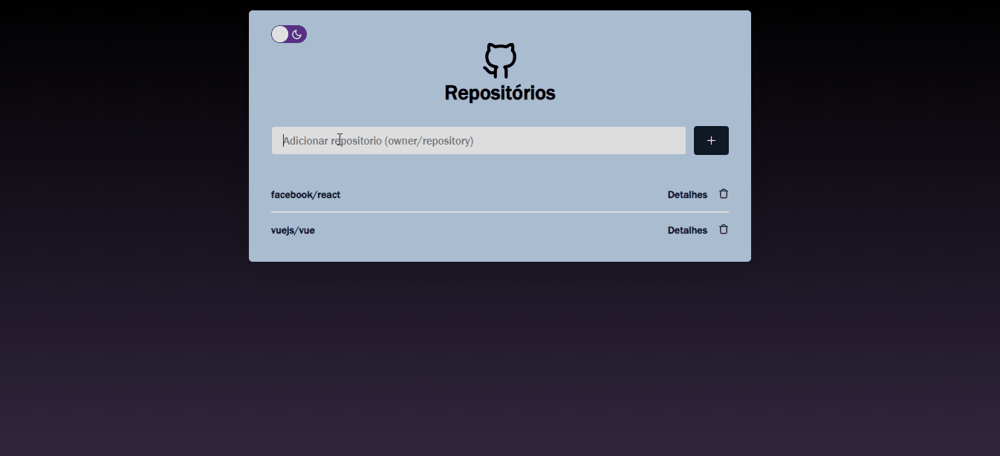

<h1 align="center">
Manygit
</h1>

<p align="center">
<strong>
React js application to manage the issues of a repository on github. 
</strong>
</p>

<p align="center">I've used the github API for the services on this front</p>

</p>
<p align="center">
  
  <a aria-label="React Version" href="https://github.com/facebook/react/blob/master/CHANGELOG.md#16120-november-14-2019">
    </img>
  </a>
  <a aria-label="Github API" href="https://api.github.com/">
    </img>
  </a>

</p>

To init the Frontend aplication in React, do the follow lines:

```bash
cd manygit-frontend
yarn install
yarn start
```

After this, the React will load a the aplication on the page `localhost:3000`


